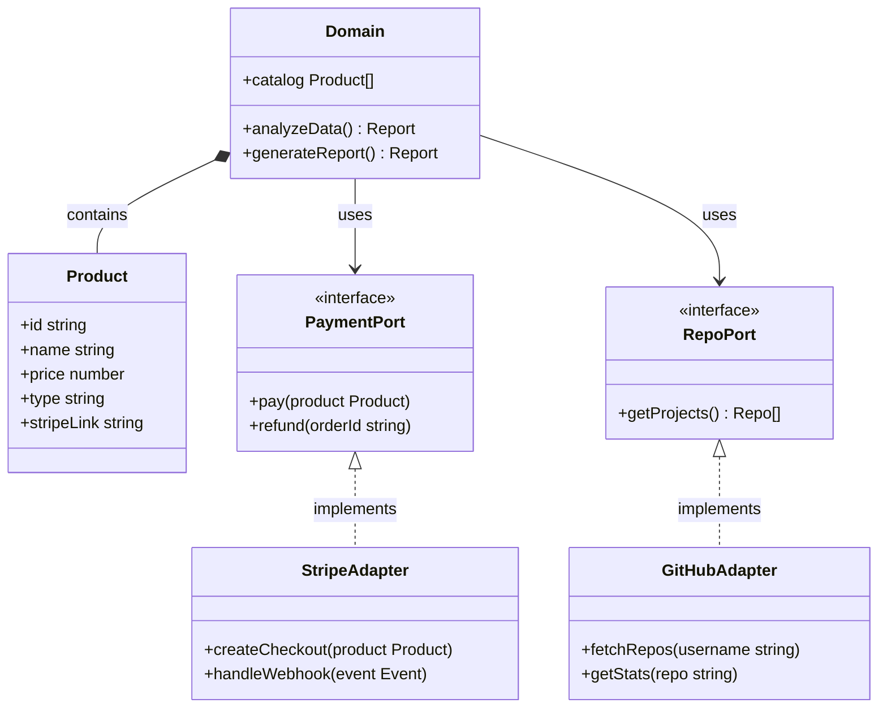

# Architecture Hexagonale

```mermaid
classDiagram
    class Domain {
        +catalog Product[]
        +analyzeData() Report
        +generateReport() Report
    }
    class Product {
        +id string
        +name string
        +price number
        +type string
        +stripeLink string
    }
    class PaymentPort {
        <<interface>>
        +pay(product Product)
        +refund(orderId string)
    }
    class RepoPort {
        <<interface>>
        +getProjects() Repo[]
    }
    class StripeAdapter {
        +createCheckout(product Product)
        +handleWebhook(event Event)
    }
    class GitHubAdapter {
        +fetchRepos(username string)
        +getStats(repo string)
    }
    Domain --> PaymentPort : uses
    Domain --> RepoPort : uses
    PaymentPort <|.. StripeAdapter : implements
    RepoPort <|.. GitHubAdapter : implements
    Domain *-- Product : contains
```
